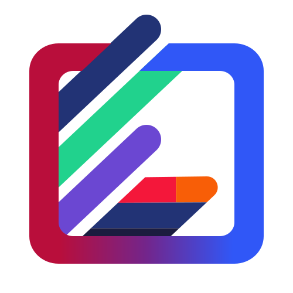

<h1 align="center">FrameBar</h1>

<p align="center">A flexible and customizable Compose Multiplatform seekbar for frame-based timelines</p>

<p align="center">
  
</p>

<p align="center">
  <a href="https://search.maven.org/search?q=g:com.rafambn%20AND%20a:FrameBar">
    
  </a>
  <a href="./LICENSE">
    
  </a>
  
</p>

<p align="center">
A customizable Kotlin Multiplatform seekbar component for Compose Multiplatform applications. Perfect for media players, video editing tools, or any scenario requiring precise position control within a frame-based timeline.</p>

<table align="center">
  <tr>
    <td align="center">
      <a href="https://framebar.rafambn.com/"><strong>FrameBar Demo (WASM)</strong></a>
    </td>
  </tr>
</table>

## Key Features

- **Precise Control**: Support for both continuous (`Float`) and discrete (`Int`) navigation.
- **Fully Customizable**: Configure marker and pointer sizes, offsets, colors, and bitmap assets.
- **Cross-Platform**: Works on Android, iOS, Desktop, Web, and WASM.
- **Flexible Pointer Selection**: Choose left, center, or right alignment behavior.
- **Pointer Coercion Support**: Keep pointer constrained to bounds when needed.
- **Touch and Mouse Input**: Full drag/seek support across input types.

## Setup

Add FrameBar to your `commonMain` dependencies:

```kotlin
kotlin {
    sourceSets {
        commonMain.dependencies {
            implementation("com.rafambn:FrameBar:1.0.0")
        }
    }
}
```

## Usage

### Basic Usage

```kotlin
import com.rafambn.framebar.FrameBar
import com.rafambn.framebar.Marker
import androidx.compose.runtime.mutableStateOf
import androidx.compose.runtime.remember
import androidx.compose.ui.unit.DpSize

@Composable
fun MyVideoPlayer() {
    val currentPosition = remember { mutableStateOf(0f) }

    val markers = listOf(
        Marker(size = DpSize(10.dp, 40.dp), topOffset = 0.dp, color = Color.Gray),
        Marker(size = DpSize(10.dp, 40.dp), topOffset = 10.dp, color = Color.Gray),
        Marker(size = DpSize(10.dp, 40.dp), topOffset = 0.dp, color = Color.Gray),
    )

    val pointer = Marker(
        size = DpSize(10.dp, 40.dp),
        topOffset = 5.dp,
        color = Color.Yellow,
    )

    FrameBar(
        pointer = pointer,
        markers = markers,
        value = currentPosition.value,
        onValueChange = { newPosition ->
            currentPosition.value = newPosition
        },
    )
}
```

### Discrete Index-Based Navigation

```kotlin
val currentFrame = remember { mutableStateOf(0) }

FrameBar(
    pointer = pointer,
    markers = frameMarkers,
    index = currentFrame.value,
    onIndexChange = { newFrame ->
        currentFrame.value = newFrame
    }
)
```

### Custom Value Range

```kotlin
FrameBar(
    value = currentPosition.value,
    valueRange = 0f..100f, // Map pixels to custom range
    onValueChange = { normalizedValue ->
        // Convert back to your application's values
        val actualPosition = normalizedValue * totalDurationMs
        seekTo(actualPosition)
    }
)
```

### Event Handling

```kotlin
FrameBar(
    pointer = pointer,
    markers = markers,
    value = currentPosition.value,
    onValueChange = { position ->
        // Continuous updates during drag
        updatePosition(position)
    },
    onDragStarted = {
        // User started dragging
        showPreview()
    },
    onDragStopped = {
        // User finished dragging
        hidePreview()
        commitPosition()
    }
)
```

### Customization

Marker Configuration

```kotlin
val coloredMarker = Marker(
    size = DpSize(15.dp, 20.dp),
    topOffset = 10.dp,
    color = Color.Blue
)

val imageMarker = Marker(
    size = DpSize(20.dp, 30.dp),
    topOffset = 5.dp,
    bitmap = myImageBitmap
)
```

Pointer selection modes:

```kotlin
import com.rafambn.framebar.enums.PointerSelection

FrameBar(
    pointerSelection = PointerSelection.LEFT,   // Left edge of pointer
    // or
    pointerSelection = PointerSelection.CENTER, // Center of pointer (default)
    // or
    pointerSelection = PointerSelection.RIGHT,  // Right edge of pointer
    // ... other parameters
)
```

Pointer coercion mode:

```kotlin
import com.rafambn.framebar.enums.CoercePointer

FrameBar(
    coercedPointer = CoercePointer.COERCED, // Pointer stays within bounds
    // or
    coercedPointer = CoercePointer.NOT_COERCED, // Default behavior
    // ... other parameters
)
```